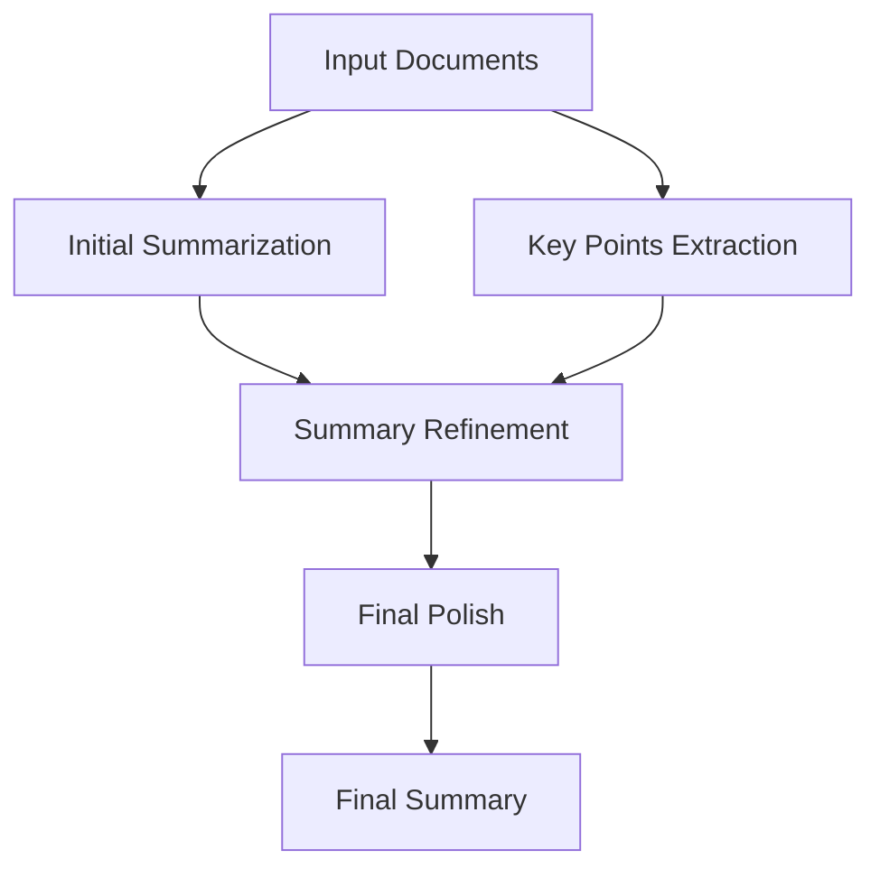

# Text Summarization Project

A comprehensive text summarization tool built with **LangChain** and **LangGraph** that provides both basic and advanced summarization capabilities using Large Language Models.

## Features

- 🔧 **Basic Summarization**: Simple, fast text summarization using LangChain
- 🚀 **Advanced Workflows**: Multi-step summarization using LangGraph with:
  - Initial summarization
  - Key points extraction
  - Summary refinement
  - Final polishing
- 📁 **Multiple Input Types**: Support for text files, PDFs, Word documents, and direct text input
- 🎯 **Batch Processing**: Summarize entire directories of documents
- 📊 **Statistics**: Get compression ratios and word counts
- 🎨 **Beautiful CLI**: Rich terminal interface with progress bars and formatted output
- ⚙️ **Configurable**: Customizable models, prompts, and parameters

## Installation

1. **Clone or create the project directory:**
   ```bash
   mkdir text-summarization
   cd text-summarization
   ```

2. **Install dependencies:**
   ```bash
   pip install -r requirements.txt
   ```

3. **Setup configuration:**
   ```bash
   python main.py setup
   ```

4. **Add your Perplexity API key to `.env` file:**
   ```bash
   PERPLEXITY_API_KEY=your_perplexity_api_key_here
   ```

## Quick Start

1. **Start the server:**
   ```bash
   python app.py
   # Or using uvicorn directly:
   uvicorn app:app --reload --host 0.0.0.0 --port 9000
   ```

2. **Access the API:**
   - **Interactive docs**: http://localhost:9000/docs
   - **Alternative docs**: http://localhost:9000/redoc
   - **Health check**: http://localhost:9000/health

3. **Test the API:**
   ```bash
   python api_examples.py
   # Or run the comprehensive demo:
   python examples/api_demo.py
   ```

## Architecture

### LangChain Components
- **Document Loaders**: Handle various file formats (TXT, PDF, DOCX, MD)
- **Text Splitters**: Break large documents into manageable chunks
- **Summarization Chains**: Pre-built chains for different summarization strategies
- **Custom Prompts**: Flexible prompt templates for specific needs

### LangGraph Workflow
The advanced summarization uses a multi-step workflow:

1. **Initial Summarization**: Create a comprehensive first-pass summary
2. **Key Points Extraction**: Identify the most important information
3. **Summary Refinement**: Improve the summary using extracted key points
4. **Final Polish**: Create a professional, well-structured final summary



## Usage Examples

### FastAPI Server Examples

#### Using curl:
```bash
# Health check
curl http://localhost:9000/health

# Basic text summarization
curl -X POST "http://localhost:9000/summarize/text" \
     -H "Content-Type: application/json" \
     -d '{"text": "Your long text here...", "summary_type": "basic"}'

# Advanced summarization
curl -X POST "http://localhost:9000/summarize/text" \
     -H "Content-Type: application/json" \
     -d '{"text": "Your text here...", "summary_type": "advanced"}'

# File upload
curl -X POST "http://localhost:9000/summarize/file" \
     -F "file=@document.pdf" \
     -F "summary_type=advanced"
```

#### Using Python requests:
```python
import requests

# Text summarization
response = requests.post("http://localhost:9000/summarize/text", 
    json={"text": "Your text here...", "summary_type": "basic"})
print(response.json())

# File upload
with open("document.pdf", "rb") as f:
    files = {"file": f}
    data = {"summary_type": "advanced"}
    response = requests.post("http://localhost:9000/summarize/file", 
                           files=files, data=data)
    print(response.json())
```


## Configuration

### Environment Variables (.env)
```bash
# Required
PERPLEXITY_API_KEY=your_perplexity_api_key_here

# Optional
DEFAULT_MODEL=llama-3.1-sonet-large-128k-online
MAX_TOKENS=4000
TEMPERATURE=0.3
```

### Supported File Types
- `.txt` - Plain text files
- `.md` - Markdown files
- `.pdf` - PDF documents
- `.docx` - Word documents

## Project Structure

```
text-summarization/
├── src/
│   ├── __init__.py
│   ├── config.py              # Configuration management
│   ├── document_loader.py     # Document loading utilities
│   ├── basic_summarizer.py    # LangChain basic summarization
│   ├── langgraph_summarizer.py # LangGraph advanced workflows
│   └── api_models.py          # Pydantic models for API
├── examples/
│   ├── sample_text.txt        # Sample text for testing
│   └── api_demo.py           # Comprehensive API demonstration
├── app.py                     # FastAPI server
├── api_examples.py            # API usage examples
├── Dockerfile                 # Docker configuration
├── docker-compose.yml         # Docker Compose setup
├── requirements.txt           # Dependencies
├── env_example.txt           # Environment template
└── README.md                 # This file
```

## Advanced Features

### Custom Workflows
The LangGraph implementation allows for complex, stateful workflows:

```python
from src.langgraph_summarizer import LangGraphSummarizer

summarizer = LangGraphSummarizer()
result = summarizer.summarize_file("document.pdf")

print(result["final_summary"])      # Final polished summary
print(result["key_points"])         # Extracted key points
print(result["initial_summary"])    # First-pass summary
```

### Memory and State Management
LangGraph maintains state across the workflow, allowing for:
- Persistent context
- Workflow resumption
- State inspection
- Human-in-the-loop capabilities

### Statistics and Analytics
Get detailed information about your summarization:

```python
from src.basic_summarizer import BasicSummarizer

summarizer = BasicSummarizer()
summary = summarizer.summarize_text(text)
stats = summarizer.get_summary_stats(text, summary)

print(f"Compression: {stats['compression_percentage']}")
print(f"Original words: {stats['original_words']}")
print(f"Summary words: {stats['summary_words']}")
```

## Why LangChain and LangGraph?

### LangChain Benefits:
- **Rapid Development**: Pre-built components for common LLM tasks
- **Flexibility**: Easy to customize and extend
- **Integration**: Works with multiple LLM providers and data sources
- **Community**: Large ecosystem and active development

### LangGraph Benefits:
- **Complex Workflows**: Handle multi-step processes with dependencies
- **State Management**: Maintain context across operations
- **Reliability**: Built-in error handling and recovery
- **Scalability**: Designed for production use

### For Text Summarization:
- **Document Handling**: Automatic chunking and processing of large documents
- **Quality**: Multi-step refinement produces better summaries
- **Flexibility**: Easy to adapt for different summarization needs
- **Monitoring**: Built-in logging and state tracking

## FastAPI Server Features

### 🚀 REST API Endpoints

- **POST /summarize/text** - Summarize text directly
- **POST /summarize/file** - Upload and summarize files
- **POST /summarize/batch** - Upload and summarize multiple files
- **GET /health** - Health check endpoint
- **GET /config** - Get current configuration
- **GET /models** - List available LLM models

### 🔧 Server Management

```bash
# Start development server
python app.py

# Start with uvicorn (production)
uvicorn app:app --host 0.0.0.0 --port 9000

# Using Docker
docker-compose up -d

# View logs
docker-compose logs -f
```

### 📊 Interactive Documentation

Once the server is running, visit:
- **Swagger UI**: http://localhost:9000/docs
- **ReDoc**: http://localhost:9000/redoc

These provide interactive API documentation where you can test endpoints directly!

## Troubleshooting

### Common Issues:

1. **API Key Error**: Make sure your Perplexity API key is set in `.env`
2. **File Not Found**: Check file paths and permissions
3. **Memory Issues**: Large files are automatically chunked
4. **Rate Limits**: The tool respects API rate limits automatically
5. **Server Won't Start**: Check if port 9000 is available
6. **CORS Issues**: Configure CORS settings in `app.py` for production

### Getting Help:

#### API Help:
```bash
# Test API connection
curl http://localhost:9000/health

# Run example tests
python api_examples.py

# Run comprehensive demo
python examples/api_demo.py
```

## Contributing

Feel free to extend this project with:
- Additional file format support
- New summarization strategies
- Integration with other LLM providers
- Enhanced CLI features
- Web interface

## License

This project is open source and available under the MIT License.
